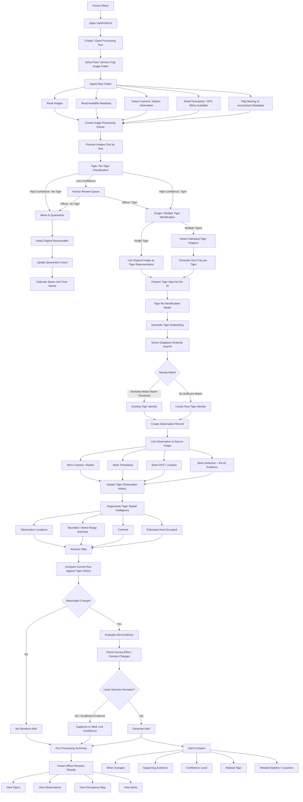
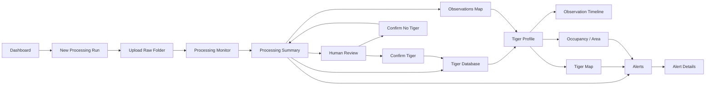

# VanDrishti AI — Detailed User & System Flow

**Version:** 1.1  
**Date:** 2026-08-17  
**Primary User:** Forest Officer  
**Deployment Context:** Pench Tiger Reserve / offline forest-office workflow

> This flow combines the VanDrishti AI workflow defined by the product team with the requirements in the Forest & Wildlife problem statement. The user-defined workflow is treated as the source of truth where it differs from the problem statement.

---

# 1. Objective

VanDrishti AI takes raw camera-trap image folders exactly as they are collected from field SD cards and transforms them into:

**cleaned image data → tiger observations → individual tiger identities → observation history → area occupancy → movement intelligence → actionable alerts**

The forest officer should not need to understand the underlying detection, Re-ID, embedding, vector-search, or spatial-analysis implementation.

The intended user journey is:

```text
Upload Raw Camera-Trap Folder
            ↓
Automatic Image Triage
            ↓
Human Review of Uncertain Tiger Classification
            ↓
Tiger / No-Tiger Dataset
            ↓
Single / Multiple Tiger Identification
            ↓
Individual Tiger Representation
            ↓
Tiger Re-ID
            ↓
Vector Similarity Search
            ↓
Existing / New Tiger Identity
            ↓
Persistent Observation Database
            ↓
Tiger-wise Spatial Analysis
            ↓
Area Occupancy + Bounded Area + Centroid
            ↓
Run-vs-History Comparison
            ↓
Movement / Deviation Alerts
```

The supplied problem statement requires the system to handle tens of thousands of raw camera-trap images, preserve recoverability of deleted/filtered images, maintain an individual tiger database, regenerate occupancy information after each run, and operate on ordinary offline field hardware. fileciteturn0file0

---

# 2. Detailed End-to-End Flowchart



---

# 3. Stage 0 — Forest Officer Entry

## User

The forest officer opens VanDrishti AI on the field laptop.

## System

The application opens the main dashboard.

The primary action should be immediately visible:

**Process Camera-Trap Images**

Secondary sections:

- Processing Runs
- Human Review
- Tigers
- Observations
- Map / Occupancy
- Alerts

The UI should be usable by forest department staff who are not data scientists. This is explicitly part of the problem requirements. fileciteturn0file0

---

# 4. Stage 1 — Create Processing Run

The officer starts a new processing run.

A processing run represents one batch of camera-trap data.

Example:

```text
Processing Run
────────────────────────────
Name: Pench Monitoring Cycle 08
Source: SD Card / Camera Trap Folder
Started: 17 Aug 2026
Status: Ready
```

The run should become the parent record for all images, observations, processing statistics, and results generated from that folder.

---

# 5. Stage 2 — Raw Folder Upload

## User Action

The officer selects the raw image directory directly from the field SD card or local storage.

The system should accept the folder without requiring the officer to manually reorganize the images.

This is important because the problem statement explicitly expects raw, unprocessed camera-trap directories as they come from field SD cards. fileciteturn0file0

## Example

```text
SD_CARD/
├── DCIM/
│   ├── 0001.JPG
│   ├── 0002.JPG
│   ├── 0003.JPG
│   └── ...
├── CAMERA_01/
├── CAMERA_02/
└── CAMERA_03/
```

---

# 6. Stage 3 — Input Inspection

Before ML processing begins, the system inspects the input.

## System checks

- Image file validity
- Supported formats
- Folder structure
- Camera/station identifiers when available
- Capture timestamps
- GPS/location metadata when available
- Duplicate or repeated files
- Missing metadata
- Inconsistent folder naming
- Potential camera clock inconsistencies

Camera clock drift, reset timestamps, inconsistent folder naming, and mixed-up SD cards are explicitly identified as expected field realities in the problem statement. fileciteturn0file0

## User Experience

The system should not block the entire run merely because metadata is messy.

Instead, it should:

```text
Valid information → Use it

Missing information → Flag it

Inconsistent information → Flag it for audit/correction
```

---

# 7. Stage 4 — Image Processing Queue

The system creates a queue containing every image.

Example:

```text
Total Images: 24,836

Queued:       24,836
Processed:          0
```

Processing happens automatically.

The officer should be able to see progress without manually supervising every image.

---

# 8. Stage 5 — Tiger / No-Tiger Classification

This is the **first ML decision point**.

Every image is classified into:

```text
High-confidence No Tiger
Low-confidence / Uncertain
High-confidence Tiger
```

This stage is where the system performs the primary blank/false-trigger filtering.

The problem statement specifically describes false triggers such as moving grass, heat shimmer, insects, rain, and shifting light. fileciteturn0file0

---

# 9. Stage 5A — High-Confidence No Tiger

If the system confidently determines that the frame does not contain a tiger:

```text
Image
  ↓
High-confidence No Tiger
  ↓
Quarantine
```

The image is removed from the **working dataset**, but not permanently destroyed.

## Quarantine

The original image remains recoverable.

Conceptually:

```text
Raw Image
   ↓
Quarantine
   ├── Original File
   ├── Source Path
   ├── Processing Run
   ├── Classification
   ├── Confidence
   └── Timestamp
```

The problem statement explicitly requires deletion to be safe and reversible through quarantine or staged deletion because irreversible deletion of field data can destroy valuable evidence. fileciteturn0file0

---

# 10. Stage 5B — Low-Confidence Classification

If the classifier cannot confidently determine whether the frame contains a tiger:

```text
Image
  ↓
Low Confidence
  ↓
Human Review Queue
```

This is the **only human-review decision point in the core automated image-classification flow**.

## Human Review Screen

The officer sees:

```text
Image
────────────────────────
AI Prediction: Tiger
Confidence: 61%

[ Confirm Tiger ]
[ Confirm No Tiger ]
```

## Confirm No Tiger

```text
Human Review
     ↓
Confirm No Tiger
     ↓
Quarantine
```

## Confirm Tiger

```text
Human Review
     ↓
Confirm Tiger
     ↓
Single / Multiple Tiger Identification
```

Every human correction should be auditable.

The problem statement requires automated decisions to be auditable and correctable by a human. fileciteturn0file0

---

# 11. Stage 5C — High-Confidence Tiger

If the classifier confidently determines that a tiger is present:

```text
High-confidence Tiger
        ↓
Continue Automatically
```

No human review is required.

The image proceeds to tiger-count identification.

---

# 12. Stage 6 — Single / Multiple Tiger Identification

The system now determines how many individual tigers are present in the image.

There is **no human-review branch at this stage**.

The possible outputs are:

```text
Single Tiger
Multiple Tigers
```

---

# 13. Stage 6A — Single Tiger

If exactly one tiger is present:

```text
Tiger Image
     ↓
Single Tiger
     ↓
Use Original Image
     ↓
Re-ID
```

## Important Rule

**Do not create a separate crop for a single tiger.**

The original image itself becomes the tiger representation passed into the Re-ID stage.

---

# 14. Stage 6B — Multiple Tigers

If multiple tigers are detected:

```text
Original Image
      ↓
Multiple Tigers
      ↓
Detect Individual Tiger Regions
      ↓
Generate Individual Crops
```

Example:

```text
Camera Image
     │
     ├── Tiger A → Crop A
     ├── Tiger B → Crop B
     └── Tiger C → Crop C
```

Each crop becomes an independent Re-ID input.

This ensures that multiple individuals in one camera-trap frame are not incorrectly treated as a single identity.

---

# 15. Stage 7 — Re-ID Input

At this point every tiger observation has exactly one Re-ID input.

```text
Single Tiger
    ↓
Original Image
    ↓
Re-ID

Multiple Tigers
    ↓
Individual Crop
    ↓
Re-ID
```

The system maintains the relationship between the Re-ID input and its source image.

---

# 16. Stage 8 — Tiger Re-Identification

The Re-ID model processes each tiger representation.

```text
Tiger Image / Crop
        ↓
Re-ID Model
        ↓
Tiger Embedding
```

The embedding is a numerical representation of the tiger's visual identity characteristics.

The officer does not need to interact with the embedding itself.

---

# 17. Stage 9 — Vector Database Search

The generated embedding is searched against the persistent tiger catalogue.

```text
Tiger Embedding
       ↓
Vector Database
       ↓
Similarity Search
       ↓
Best Candidate / Candidates
```

The vector database grows as new tiger observations are processed.

---

# 18. Stage 10 — Existing or New Tiger

The system evaluates the similarity result.

## Existing Tiger

If the similarity is sufficiently high:

```text
Embedding
   ↓
Strong Match
   ↓
Existing Tiger Identity
   ↓
Create New Observation
```

Example:

```text
Tiger T-023
    │
    ├── Observation 01
    ├── Observation 02
    ├── Observation 03
    └── New Observation 04
```

## New Tiger

If no existing tiger has a sufficient match:

```text
Embedding
   ↓
No Sufficient Match
   ↓
Create New Tiger
   ↓
Assign Tiger ID
   ↓
Store First Observation
```

Example:

```text
New Tiger
   ↓
T-041
   ↓
First Observation
```

---

# 19. Stage 11 — Observation Record

Every successful identification creates an observation.

The persistent database should connect:

```text
Tiger Identity
      │
      ▼
Observation
      │
      ├── Source Image
      ├── Tiger Crop (if multiple-tiger image)
      ├── Camera / Station
      ├── Timestamp
      ├── GPS / Location
      ├── Detection Evidence
      └── Re-ID Similarity / Evidence
```

The problem statement specifically requires the persistent database to link each identified individual to every image, station, timestamp, and GPS location where it was captured. fileciteturn0file0

---

# 20. Stage 12 — Tiger Profile

The officer can open any tiger identity.

Example:

```text
Tiger T-023
────────────────────────────

Observations       37
Stations            8
First Captured      03 May 2026
Last Captured       17 Aug 2026

Current Centroid
[ Map ]

Estimated Area
18.4 sq km
```

The profile should provide access to:

- Images
- Observations
- Stations
- Timeline
- Map
- Occupancy
- Alerts

---

# 21. Stage 13 — Observation Map

The system plots every known observation for the individual.

```text
Tiger T-023

        ● Station 12

  ● Station 07

             ● Station 15

      ● Station 08

                ● Station 19
```

The map should allow the officer to understand where the individual has been observed.

---

# 22. Stage 14 — Tiger-Wise Spatial Analysis

After the processing run, the system regenerates spatial intelligence for every tiger.

The problem statement requires this to happen **after each processing run**. fileciteturn0file0

For each tiger, calculate:

1. Set of observation locations
2. Bounded/home-range estimate
3. Centroid of activity
4. Estimated area occupied

---

# 23. Stage 15 — Bounded / Home-Range Area

The system derives a geographic area from the tiger's observation history.

Conceptually:

```text
Observation Points
       ↓
Spatial Analysis
       ↓
Bounded / Home-Range Estimate
       ↓
Estimated Occupied Area
```

The UI should distinguish a derived estimate from a guaranteed biological territory.

---

# 24. Stage 16 — Centroid

The system derives the tiger's activity centroid.

```text
Observation Locations
       ↓
Spatial Calculation
       ↓
Activity Centroid
```

The centroid should be displayed on the reserve map.

---

# 25. Stage 17 — Area Overlap

The reserve map should allow the officer to see overlapping areas between individuals.

Example:

```text
Tiger T-001 Area
       ┌───────────────┐
       │               │
       │      █████████████
       │      █ Tiger T-002
       └──────█████████───┘
              █
              █ Tiger T-001
```

Overlap between individuals is a management signal and should therefore be visually distinguishable on the map. fileciteturn0file0

---

# 26. Stage 18 — Run-vs-History Comparison

The system compares the current processing run with each tiger's established history.

```text
Previous History
       +
Current Run
       ↓
Change Detection
       ↓
Movement / Trend Analysis
```

The purpose is not simply to show new observations.

It is to identify meaningful deviations.

---

# 27. Stage 19 — Alert Detection

The alert engine checks for meaningful changes.

The required minimum alert categories from the problem statement are:

### 1. Range Centroid Shift

Raise an alert when the range centroid moves beyond the defined threshold.

Problem-statement thresholds:

```text
Core:
15–20 sq km threshold

Buffer:
5 km threshold
```

These thresholds should be configurable rather than hard-coded into the UI.

---

### 2. First Capture at a New Station

```text
Tiger T-023
     ↓
Station never previously used
     ↓
New Station Observation
     ↓
Potential Alert
```

---

### 3. Movement Toward Buffer / Village-Adjacent Stations

```text
Tiger Observation
       ↓
Buffer / Village-Adjacent Station
       ↓
Evaluate Movement
       ↓
Alert if meaningful
```

---

### 4. Prolonged Absence

If an individual that has historically appeared regularly stops appearing for a meaningful period:

```text
Regular Historical Presence
          ↓
Prolonged Absence
          ↓
Deviation Analysis
          ↓
Potential Alert
```

The exact absence period should be configurable based on survey cadence and reserve operations.

---

# 28. Stage 20 — Survey Effort Validation

This is an important part of the alert flow.

The system should **not automatically interpret every new station observation as tiger movement**.

Example:

```text
New Tiger Station
       ↓
Was the station previously available?
       │
   ┌───┴────┐
   │        │
  Yes       No
   │        │
   ▼        ▼
Possible   New camera
Movement   installed
   │        │
   ▼        ▼
Evaluate   Do not treat
Deviation  automatically
            as movement
```

The problem statement specifically requires the alert system to distinguish genuine behavioural deviation from changes caused by uneven survey effort, such as a new camera being installed at a station. fileciteturn0file0

---

# 29. Stage 21 — Alert Confidence

Every alert should contain:

```text
Alert
 ├── What changed
 ├── Supporting evidence
 ├── Tiger identity
 ├── Related observations
 ├── Related station(s)
 └── Confidence level
```

Example:

```text
MOVEMENT DEVIATION

Tiger: T-023

What changed:
Tiger T-023 was detected at Station P-17,
which was not part of its previous observation area.

Evidence:
- 4 observations at P-17
- Previous centroid: ...
- Current centroid: ...
- Station operational during previous surveys

Confidence:
High
```

The problem statement explicitly requires every alert to state what changed, supporting evidence, and confidence level. fileciteturn0file0

---

# 30. Stage 22 — Processing Summary

At the end of the run, the officer sees a complete summary.

Example:

```text
PROCESSING COMPLETE

Input
────────────────────────────
Images processed          24,836

Classification
────────────────────────────
High-confidence Tiger        412
Human Review Required         86
Quarantined                24,338

Tiger Processing
────────────────────────────
Tiger Observations            487
Existing Tiger Matches        431
New Tigers                     56

Spatial Intelligence
────────────────────────────
Tigers with Areas              48
Tigers with Centroids          48

Alerts
────────────────────────────
Movement Alerts                 7
New Station Alerts              5
Buffer Alerts                   2
Absence Alerts                  1
```

The exact metrics displayed can evolve.

---

# 31. Stage 23 — Final Officer Workflow

After processing, the officer can choose what to investigate.

```text
Processing Complete
        │
        ├── Human Review
        │
        ├── Tigers
        │
        ├── Observations
        │
        ├── Reserve Map
        │
        └── Alerts
```

The officer should not need to manually inspect tens of thousands of images unless the system specifically identifies them as requiring attention.

---

# 32. Complete Detailed Flow

```text
FOREST OFFICER
      │
      ▼
OPEN APPLICATION
      │
      ▼
CREATE PROCESSING RUN
      │
      ▼
SELECT RAW CAMERA-TRAP FOLDER
      │
      ▼
INPUT INSPECTION
      │
      ├── Images
      ├── Camera / Station
      ├── Timestamp
      ├── GPS
      └── Metadata Issues
      │
      ▼
IMAGE PROCESSING QUEUE
      │
      ▼
TIGER / NO-TIGER CLASSIFICATION
      │
      ├────────────────────────────────┐
      │                                │
      ▼                                ▼
HIGH CONFIDENCE NO TIGER          LOW CONFIDENCE
      │                                │
      ▼                                ▼
QUARANTINE                       HUMAN REVIEW
      │                                │
      │                          ┌─────┴─────┐
      │                          ▼           ▼
      │                     NO TIGER       TIGER
      │                          │           │
      │                          ▼           │
      │                      QUARANTINE      │
      │                                      │
      └──────────────────────────────────────┤
                                             │
                              HIGH CONFIDENCE TIGER
                                             │
                                             ▼
                              SINGLE / MULTIPLE TIGER
                                   IDENTIFICATION
                                             │
                              ┌──────────────┴──────────────┐
                              │                             │
                              ▼                             ▼
                         SINGLE TIGER                 MULTIPLE TIGERS
                              │                             │
                              ▼                             ▼
                      USE ORIGINAL IMAGE             DETECT REGIONS
                              │                             │
                              │                             ▼
                              │                       GENERATE CROPS
                              │                             │
                              └──────────────┬──────────────┘
                                             ▼
                                      RE-ID MODEL
                                             │
                                             ▼
                                     TIGER EMBEDDING
                                             │
                                             ▼
                                    VECTOR DB SEARCH
                                             │
                                      ┌──────┴──────┐
                                      │             │
                                      ▼             ▼
                                EXISTING MATCH   NO MATCH
                                      │             │
                                      │             ▼
                                      │        NEW TIGER ID
                                      │             │
                                      └──────┬──────┘
                                             ▼
                                    STORE OBSERVATION
                                             │
                           ┌─────────────────┼──────────────────┐
                           │                 │                  │
                           ▼                 ▼                  ▼
                        IMAGE            STATION            TIMESTAMP
                           │                 │                  │
                           └─────────────────┼──────────────────┘
                                             ▼
                                           GPS
                                             │
                                             ▼
                                  TIGER OBSERVATION HISTORY
                                             │
                                             ▼
                                  REGENERATE SPATIAL DATA
                                             │
                           ┌─────────────────┼──────────────────┐
                           │                 │                  │
                           ▼                 ▼                  ▼
                     OBSERVATION       BOUNDED AREA        CENTROID
                       LOCATIONS        / HOME RANGE
                           │                 │                  │
                           └─────────────────┼──────────────────┘
                                             ▼
                                      AREA OCCUPIED
                                             │
                                             ▼
                                      RESERVE MAP
                                             │
                                             ▼
                                  COMPARE WITH HISTORY
                                             │
                                             ▼
                                  DEVIATION ANALYSIS
                                             │
                                             ▼
                                  SURVEY-EFFORT CHECK
                                             │
                                      ┌──────┴──────┐
                                      │             │
                                      ▼             ▼
                                NO REAL CHANGE   REAL CHANGE
                                      │             │
                                      ▼             ▼
                                  NO ALERT      GENERATE ALERT
                                                    │
                                                    ▼
                                         CHANGE + EVIDENCE
                                         + CONFIDENCE LEVEL
                                                    │
                                                    ▼
                                             OFFICER DASHBOARD
```

---

# 33. User-Facing Navigation Flow



---

# 34. What the Officer Actually Does

The complete system may contain many automated stages, but the officer's direct actions are intentionally limited.

```text
1. Open application
        ↓
2. Select raw image folder
        ↓
3. Start processing
        ↓
4. Review uncertain classification images
        ↓
5. Inspect identified tigers
        ↓
6. Inspect map / occupancy
        ↓
7. Investigate alerts
```

Everything between these actions is automated.

---

# 35. Auditability

Every automated decision should be traceable.

For an image:

```text
Image
 ├── Classification
 ├── Classification Confidence
 ├── Processing Run
 ├── Source Folder
 └── Human Decision (if reviewed)
```

For a tiger identity:

```text
Tiger ID
 ├── Re-ID Evidence
 ├── Source Image(s)
 ├── Crop(s)
 ├── Observation(s)
 ├── Station(s)
 ├── Timestamp(s)
 └── Location(s)
```

For an alert:

```text
Alert
 ├── Trigger
 ├── Tiger
 ├── Changed Observation(s)
 ├── Historical Comparison
 ├── Survey-Effort Context
 └── Confidence
```

This supports the requirement that automated decisions be auditable and correctable. fileciteturn0file0

---

# 36. Offline / Field Hardware Flow

The application is designed around the field environment described in the problem statement.

```text
Camera Trap SD Card
        ↓
Field Laptop
        ↓
VanDrishti AI
        ↓
Local ML Models
        ↓
Local Vector Database
        ↓
Local Tiger Database
        ↓
Local Map / Alerts
```

The core processing should not depend on continuous internet connectivity.

The problem statement specifically requires operation on a standard laptop without a dedicated GPU and without internet connectivity. fileciteturn0file0

---

# 37. Privacy Handling

Images containing humans must be handled with appropriate privacy safeguards.

The system should therefore preserve the source image relationship while allowing privacy-aware handling of human-containing frames.

The exact implementation of privacy protection is a separate technical requirement and should be defined before final implementation.

The requirement for appropriate safeguards for images capturing humans is explicitly stated in the problem statement. fileciteturn0file0

---

# 38. Core Decision Rules

## Rule 1 — Classification

```text
High-confidence No Tiger
        → Quarantine

Low Confidence
        → Human Review

High-confidence Tiger
        → Continue
```

## Rule 2 — Tiger Count

```text
Single Tiger
        → Original Image
        → Re-ID

Multiple Tigers
        → Individual Detection
        → Individual Crops
        → Re-ID per Tiger
```

## Rule 3 — Identity

```text
Sufficient Vector Similarity
        → Existing Tiger

No Sufficient Similarity
        → New Tiger
```

## Rule 4 — Spatial Intelligence

```text
All Tiger Observations
        ↓
Observation Locations
        ↓
Bounded / Home-Range Estimate
        ↓
Centroid
        ↓
Area Occupied
```

## Rule 5 — Alerts

```text
Current Run
      +
Historical Tiger Data
      +
Survey Effort Context
      ↓
Deviation Analysis
      ↓
Meaningful Change
      ↓
Alert + Evidence + Confidence
```

---

# 39. MVP User Flow

The first demonstrable version should successfully support:

```text
Upload raw folder
       ↓
Classify every image
       ↓
Quarantine confident no-tiger images
       ↓
Send uncertain classifications to human review
       ↓
Process confirmed/identified tiger images
       ↓
Detect single vs multiple tigers
       ↓
Use original image for single tiger
       ↓
Crop individuals for multiple tigers
       ↓
Generate Re-ID embeddings
       ↓
Search vector database
       ↓
Create / update tiger identity
       ↓
Store observation + image + station + time + GPS
       ↓
Generate tiger-wise observation map
       ↓
Generate bounded area
       ↓
Generate centroid
       ↓
Compare against historical observations
       ↓
Generate initial movement/deviation alerts
```

---

# 40. Final Product Flow

The complete VanDrishti AI concept can be reduced to one precise chain:

```text
RAW FIELD DATA
      ↓
IMAGE INGESTION
      ↓
TIGER CLASSIFICATION
      │
      ├── NO TIGER → QUARANTINE
      │
      ├── UNCERTAIN → HUMAN REVIEW
      │                    │
      │                    ├── NO TIGER → QUARANTINE
      │                    └── TIGER → CONTINUE
      │
      └── TIGER → CONTINUE
                    ↓
             TIGER COUNT
              │         │
              ▼         ▼
            SINGLE    MULTIPLE
              │         │
              │         ▼
              │     INDIVIDUAL CROPS
              │         │
              └────┬────┘
                   ▼
                 RE-ID
                   ↓
              EMBEDDING
                   ↓
             VECTOR SEARCH
                   ↓
          EXISTING / NEW TIGER
                   ↓
              OBSERVATION
                   ↓
        IMAGE + STATION + TIME + GPS
                   ↓
          TIGER HISTORY DATABASE
                   ↓
           SPATIAL REGENERATION
             │       │       │
             ▼       ▼       ▼
          LOCATIONS AREA   CENTROID
                    │
                    ▼
               AREA OCCUPIED
                    ↓
                MAP VIEW
                    ↓
           HISTORY COMPARISON
                    ↓
          SURVEY-EFFORT CHECK
                    ↓
             DEVIATION ENGINE
                    ↓
                  ALERT
                    ↓
       CHANGE + EVIDENCE + CONFIDENCE
                    ↓
              FOREST OFFICER
```

This is the detailed operational flow that should guide the subsequent **UI design, backend architecture, ML pipeline, database schema, vector database design, and alert-engine implementation**.
